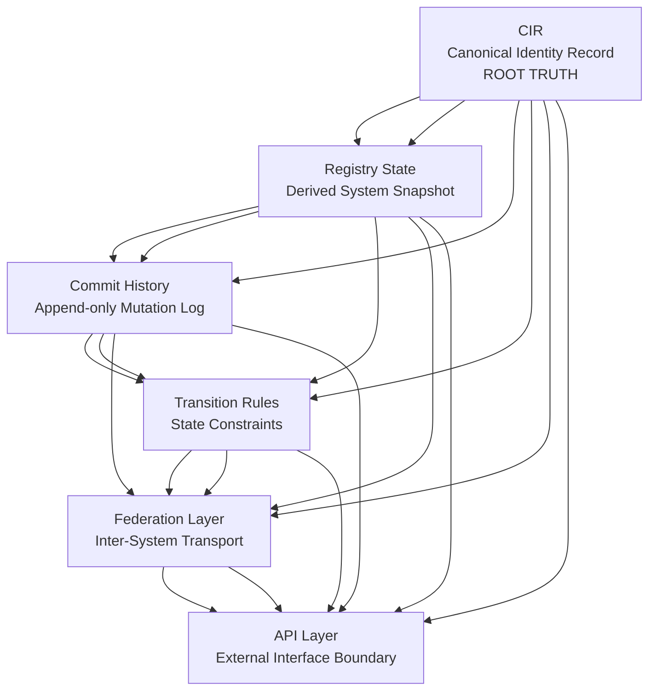
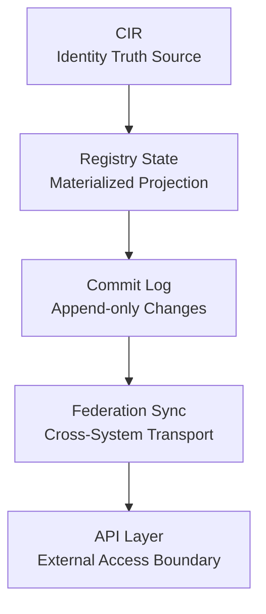

# Asveora System Map (v1 Canonical View)

## 1. What Asveora Is

Asveora (pronounced Az·Vee·Oh·Ra) is an open source decentralized distributed ecosystem framework that contains a **deterministic specification system for distributed identity and registry consistency**.

It defines how identity (CIR) is structured, validated, evolved, shared, and interpreted across multiple instances. It does **not** define runtime execution logic.

---

## 2. Core System Layers

Asveora is organized into five conceptual layers:

---

## Layer 01 – Semantic Layer (RFC)

**Location:** `rfc/`

This is the human-readable system definition.

It defines:

* identity model (CIR, APA, PIK, VSIG, AUID)
* federation behavior (conceptual)
* governance rules (conceptual constraints)
* lifecycle definitions
* system philosophy and architecture

**Purpose:**

> “What the system means”

---

## Layer 02 – Structural Layer (Schemas)

**Location:** `schemas/`

This layer defines strict data contracts.

It specifies:

* valid structure of CIR and registry objects
* commit formats and state snapshots
* federation transport envelopes
* authorization structures
* governance event logs

**Purpose:**

“What does valid system data look like?”

NOT:

* behavior
* execution
* decision logic

---

## Layer 03 – Transition Layer (Transitions)

**Location:** `transitions/`

Defines allowed state transitions:

* identity lifecycle states (INITIATED → ACTIVE → etc.)
* registry commit lifecycle
* federation sync states

**Purpose:**

> “What changes are allowed”

NOT:

* when or why transitions occur

---

## Layer 04 – Consistency Layer (Dependency Graphs)

**Location:**

* `schemas/schema-dependency-graph.*`
* `rfc/03-core-architecture/03-00-dependency-graph.md`

Defines:

* ordering rules for schemas
* dependency relationships between system components
* validation sequencing constraints

**Purpose:**

> “What depends on what”

---

## Layer 05 – External Execution Layer (NOT IN REPO)

This is the only runtime component, and it lives outside the RFC repo.

Includes:

* API servers
* registry engines
* federation nodes
* event processors

**Purpose:**

> “How the system actually runs in production environments”

The RFC repo does NOT implement this layer.

---

## 2.1 SYSTEM-MAP v2 — Truth Hierarchy Model (Canonical Abstraction Layer)

Asveora also defines an epistemic hierarchy of authority across all system components.

This layer is not structural — it defines **truth precedence and interpretation order**.

### Mermaid Truth Hierarchy Graph

### Interpretation Rules

* Higher nodes define **truth**
* Lower nodes define **representation, movement, or access**
* No lower layer may override or redefine higher-layer truth
* Federation and API layers are explicitly **non-authoritative**
* CIR is the only immutable semantic root

---

## 3. Core Data Flow Model

System behavior flows downward through derived state:

---

## 4. Authority Hierarchy (Operational View)

1. CIR (identity truth)
2. Registry state (derived truth)
3. Commit history (mutation record)
4. Transition rules (allowed state changes)
5. Federation layer (transport only)
6. API layer (output boundary only)

---

## 5. Key Design Principles

### 5.1 Determinism

Same inputs → same system state everywhere.

---

### 5.2 Separation of Concerns

* RFC = meaning
* Schemas = structure
* Transitions = allowed state movement
* Runtime = external

---

### 5.3 Registry Supremacy (Derived from CIR)

Registry is always a projection of CIR state.

It does NOT define identity truth.

---

### 5.4 Federation is Non-Authoritative

Federation:

* transports CIR state
* does NOT validate identity truth
* does NOT modify semantics

---

### 5.5 Governance is Observational

Governance:

* logs and constrains behavior
* does NOT redefine system truth
* does NOT override schema or registry

---

## 6. What This Repo Actually Is

This repository is a **formal specification and constraint system for distributed identity (CIR) and registry consistency** which means it is NOT:

* an API framework
* a runtime engine
* a backend system
* an execution environment

---

## Closing Statement

Asveora is intentionally structured to be:

* deterministic
* layered
* dependency-driven
* implementation-neutral

It defines **what must be true for distributed identity systems to remain consistent**, not how those systems are executed.
